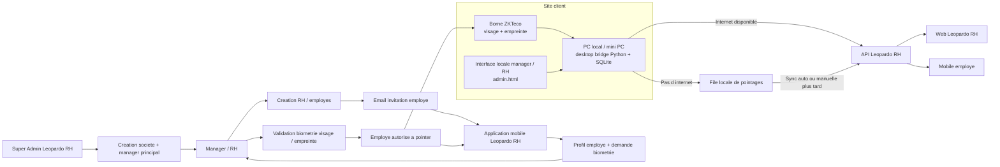
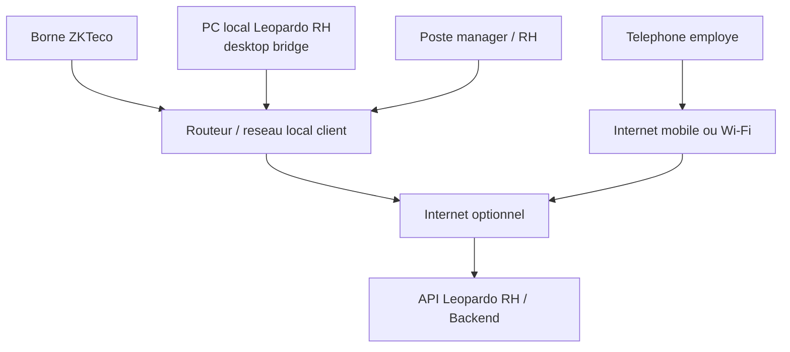

# SCHEMA DEPLOIEMENT ZKTECO CLIENT

## Vue d ensemble

Ce schema montre comment la borne ZKTeco, le PC local client, l application mobile et l API Leopardo RH collaborent en mode connecte ou offline.

## Lecture metier

- le super admin cree la societe et son manager principal
- le manager ou le RH cree les utilisateurs
- l employe recoit une invitation email
- l employe active son compte sur mobile
- l employe soumet ses donnees biometrie
- le manager ou le RH approuve
- ensuite l employe peut pointer :
  - sur mobile
  - sur la borne a l entree
- si internet est coupe, le PC local stocke les pointages
- des que la connexion revient, la synchronisation envoie les donnees a l API
- une fois synchronises, les pointages sont visibles sur le web et sur le mobile

## Schema reseau recommande

## Mode connecte

- la borne remonte vers le PC local
- le PC local synchronise automatiquement avec l API
- le mobile et le web voient rapidement les nouveaux pointages

## Mode offline

- la borne continue de fonctionner sur le reseau local
- le PC local stocke tout dans SQLite
- le manager ou le RH peut attendre plusieurs jours avant synchronisation
- lors de la synchronisation, les donnees sont poussees vers l API
- l employe retrouve ensuite ses pointages sur son mobile

## Recommandation terrain

Pour les clients avec internet instable, la meilleure architecture est :

- borne ZKTeco
- routeur local simple
- PC local dedie
- synchronisation automatique si possible
- synchronisation manuelle manager / RH en secours

Cela donne une solution robuste, simple a expliquer et realiste pour les PME.
