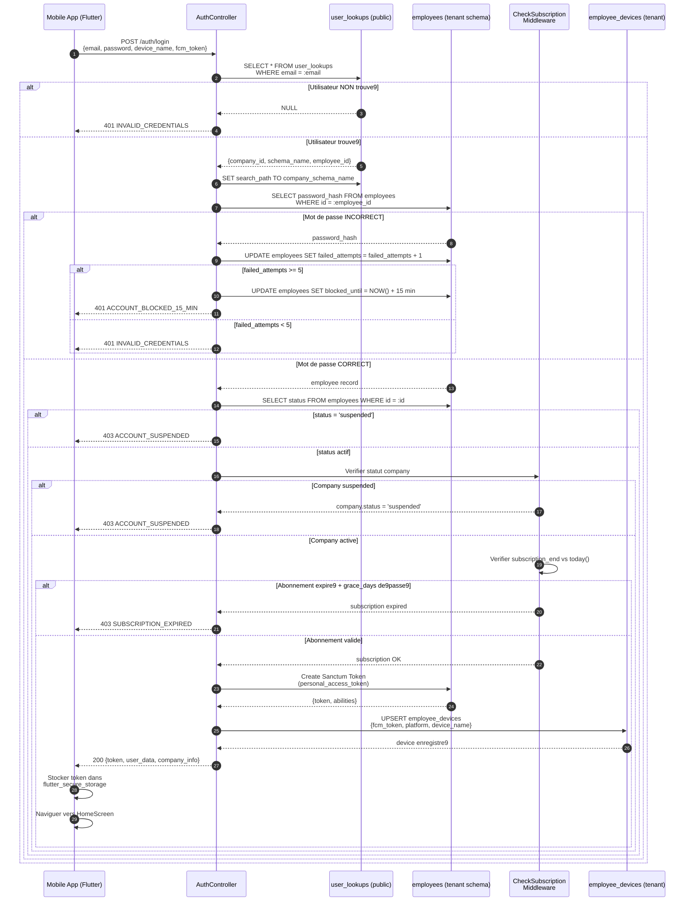

# Diagramme de se9quence — Authentification Multi-Tenant

---

## Explication des interactions

| E9tape | Interaction | De9tail |
|--------|-------------|---------|
| 1 | **Reque2te de connexion** | L'application mobile envoie les identifiants (email, mot de passe) avec les informations de l'appareil (nom, FCM token). |
| 2-3 | **Recherche dans user_lookups (public schema)** | Le controlleur interroge la table publique `user_lookups` pour retrouver le schel0me tenant associ03 3 l'email. Si l'utilisateur n'existe pas, une erreur 401 est renvoy03e imm03diatement. |
| 4-5 | **Changement de contexte tenant** | Le `search_path` PostgreSQL est bascul03 vers le sch03ma de l'entreprise pour toutes les requ00etes suivantes. |
| 6-8 | **V03rification du mot de passe** | Le mot de passe est v03rifi03 dans la table `employees` du sch03ma tenant. En cas d'03chec, le compteur `failed_attempts` est incr03ment03. Au bout de 5 03checs, le compte est bloqu03 pendant 15 minutes. |
| 9 | **V03rification du statut employ03** | Un employ03 ou une entreprise suspendus bloquent toute connexion (403). |
| 10 | **V03rification de l'abonnement** | Le middleware `CheckSubscription` compare la date de fin d'abonnement avec la date du jour, en tenant compte de la p03riode de gr02ce d03finie dans le plan. |
| 11 | **Cr03ation du token Sanctum** | Un `personal_access_token` Sanctum est g03n03r03 pour les requ00etes authentifi03es ult03rieures. |
| 12 | **Enregistrement de l'appareil** | Le token FCM est upsert03 dans `employee_devices` pour les notifications push. |
| 13-15 | **R03ponse et navigation** | L'application stocke le token de mani03re s03curis03e et navigue vers l'03cran d'accueil. |
