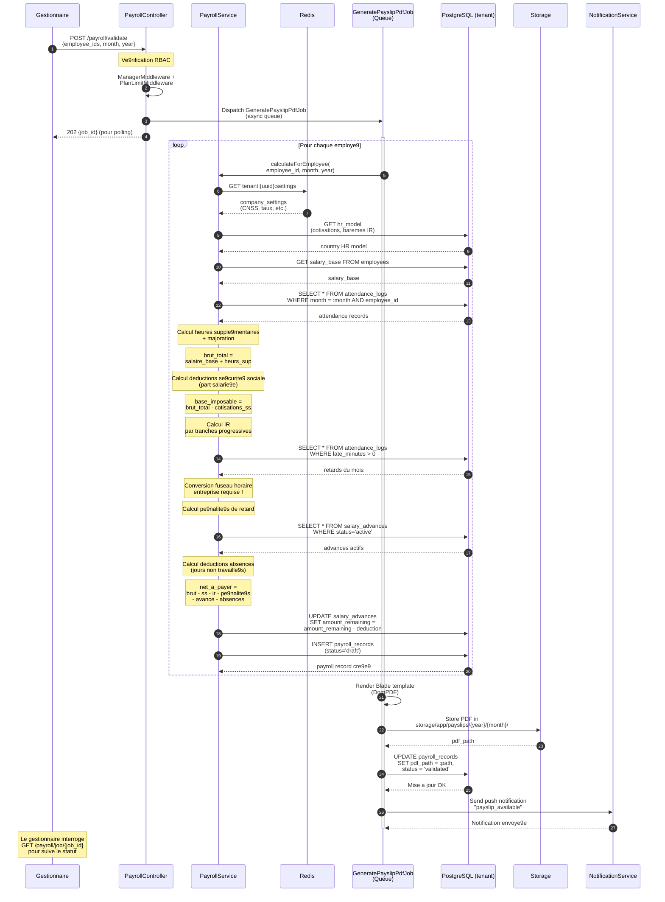

# Diagramme de se9quence — Calcul de la Paie

---

## Explication des interactions

| E9tape | Interaction | De9tail |
|--------|-------------|---------|
| 1-2 | **Reque2te de validation de paie** | Le gestionnaire lance le calcul pour une liste d'employe9s, un mois et une anne9e donne9s. Les middleware RBAC et de limites de plan sont ve9rifie9s en premier lieu. |
| 3-4 | **Job asynchrone** | Le calcul e9tant potentiellement lourd, il est dispatche9 dans une queue Laravel. Le gestionnaire rec00oit un `job_id` pour interroger le statut via polling. |
| 5a-b | **Configuration & mode9le RH** | Les re9glages de l'entreprise sont recupe9re9s depuis le cache Redis (cle9 `tenant:{uuid}:settings`). Les mode9les de cotisations et baremes IR sont issus du mode9le RH du pays. |
| 5c-e | **Calcul du brut** | Le salaire de base est additionne9 aux heures supple9mentaires calcule9es e0 partir des `attendance_logs` du mois. |
| 5f-h | **Deductions sociales et fiscales** | La se9curite9 sociale (part salarie9e) est de9duite du brut. L'imp00ft sur le revenu est calcule9 par tranches progressives. |
| 5i | **Pe9nalite9s de retard** | Les minutes de retard sont recupe9re9es depuis les pointages. La conversion en fuseau horaire de l'entreprise est obligatoire pour un calcul correct. |
| 5j-k | **Avances & absences** | Les avances sur salaire actives sont de9duites du net. Les jours d'absence non re9mune9re9s sont e9galement de9duits. |
| 5l-m | **Net e0 payer** | Le salaire net est calcule9 et stocke9 en base avec le statut `draft`. Le `amount_remaining` des avances est mis e0 jour. |
| 6-8 | **Ge9ne9ration du bulletin PDF** | Le job rend un template Blade via DomPDF, stocke le fichier dans le syste9me de fichiers et met e0 jour le chemin et le statut (`validated`). |
| 9 | **Notification employe9** | L'employe9 rec00oit une notification push l'informant que son bulletin de paie est disponible. |
