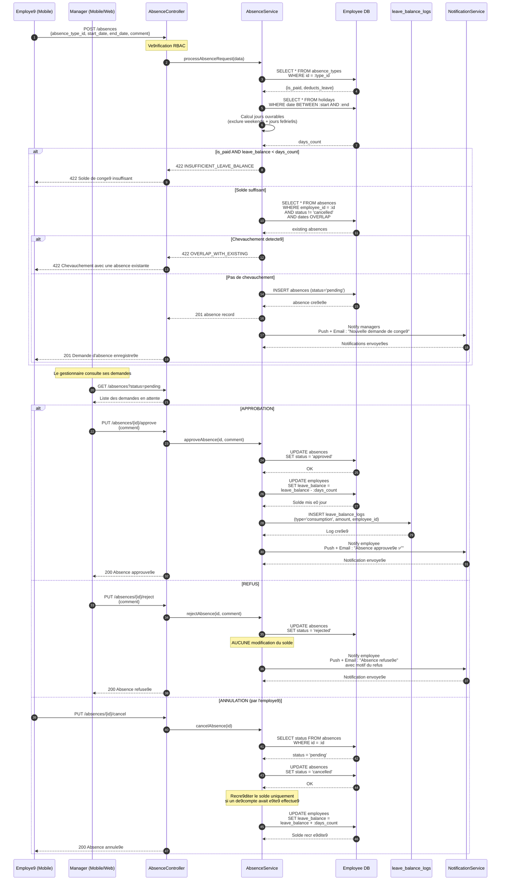

# Diagramme de se9quence — Demande et Approbation d'Absence

---

## Explication des interactions

| E9tape | Interaction | De9tail |
|--------|-------------|---------|
| 1-3 | **Soumission de la demande** | L'employe9 soumet une demande d'absence via l'application mobile avec le type, les dates et un commentaire optionnel. |
| 4-5 | **Ve9rification du type & calcul des jours** | Le service ve9rifie si le type d'absence est re9munre9 et s'il de9duit du solde de conge9. Le nombre de jours ouvrables est calcul en excluant les weekends et jours fe9rie9s. |
| 6 | **Contre9le du solde** | Si l'absence est re9munre9e et que le solde est insuffisant, la demande est rejete9e avec une erreur 422. |
| 7-8 | **De9tection de chevauchement** | Le service ve9rifie qu'il n'existe pas d'absence en chevauchement (statut diffe9rent de `cancelled`) pour les meames dates. |
| 9-10 | **Cre9ation & notification** | L'absence est cre9e9e avec le statut `pending`. Les manage9rs concern re9coivent une notification push et email. |
| 11-12 | **Consultation par le manage9r** | Le manage9r consulte les demandes en attente depuis l'application mobile ou web. |
| 13-15 | **Approbation** | Le manage9r approuve la demande. Le statut passe e0 `approved`, le solde de conge9 est de9cr 9ment e0 jour et un log de consommation est cre9e9. L'employe9 est notifie9. |
| 16-18 | **Refus** | Le manage9r refuse la demande avec un motif. Le solde n'est pas modifie9. L'employe9 est notifie9 avec la raison du refus. |
| 19-21 | **Annulation par l'employe9** | L'employe9 peut annuler une demande en attente (`pending`). Si un de9compte avait e9t effectu9, le solde est recr 9dit 9 automatiquement. |
