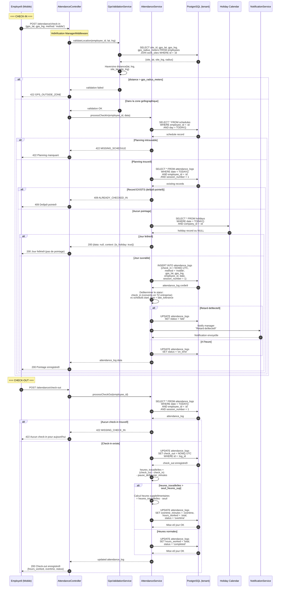

# Diagramme de se9quence — Pointage Check-in / Check-out

---

## Explication des interactions

| E9tape | Interaction | De9tail |
|--------|-------------|---------|
| 1-5 | **Validation ge9olocalisation** | L'employe9 envoie ses coordonne9es GPS. Le service calcule la distance de Haversine entre sa position et le site de travail assigne9. Si la distance de9passe le rayon autorise9, le pointage est rejete9 (422). |
| 6-7 | **Ve9rification du planning** | Le service ve9rifie qu'un planning horaire existe pour le jour en cours. Sans planning, le pointage est impossible. |
| 8 | **Double pointage** | Une recherche dans `attendance_logs` ve9rifie qu'il n'existe pas de9ja un check-in pour la journe9e et la session (session_number = 1). |
| 9-10 | **Jour fe9rie9** | Le calendrier des jours fe9rie9s de l'entreprise est consulte9. Si c'est un jour fe9rie9, le pointage n'est pas enregistre9 et le contexte est retourne9 e0 l'application. |
| 11-13 | **Enregistrement du check-in** | Le pointage est insere9 en base avec l'heure UTC. Le statut (`on_time` ou `late`) est de9termine9 en comparant l'heure convertie dans le fuseau de l'entreprise avec l'heure de de9but du planning + la tole9rance de retard. |
| 14 | **Notification de retard** | Si un retard est de9tecte9, le manage9r rec00oit une notification push imme9diatement. |
| 15-17 | **Recherche du check-in** | Au check-out, le service recherche le pointage d'entre9e du jour. S'il n'existe pas, le check-out est rejete9 (422). |
| 18-20 | **Calcul du temps travaille9** | Les heures travaille9es sont calcule9es en soustrayant la pause de9jeuner. Si le total de9passe le seuil d'heures supple9mentaires, les heures sup sont calcule9es et stocke9es se9pare9ment. |
| 21-22 | **Mise e0 jour & re9ponse** | Le statut final est mis e0 jour (`completed` ou `overtime`) et l'employe9 rec00oit le de9tail de son pointage. |
