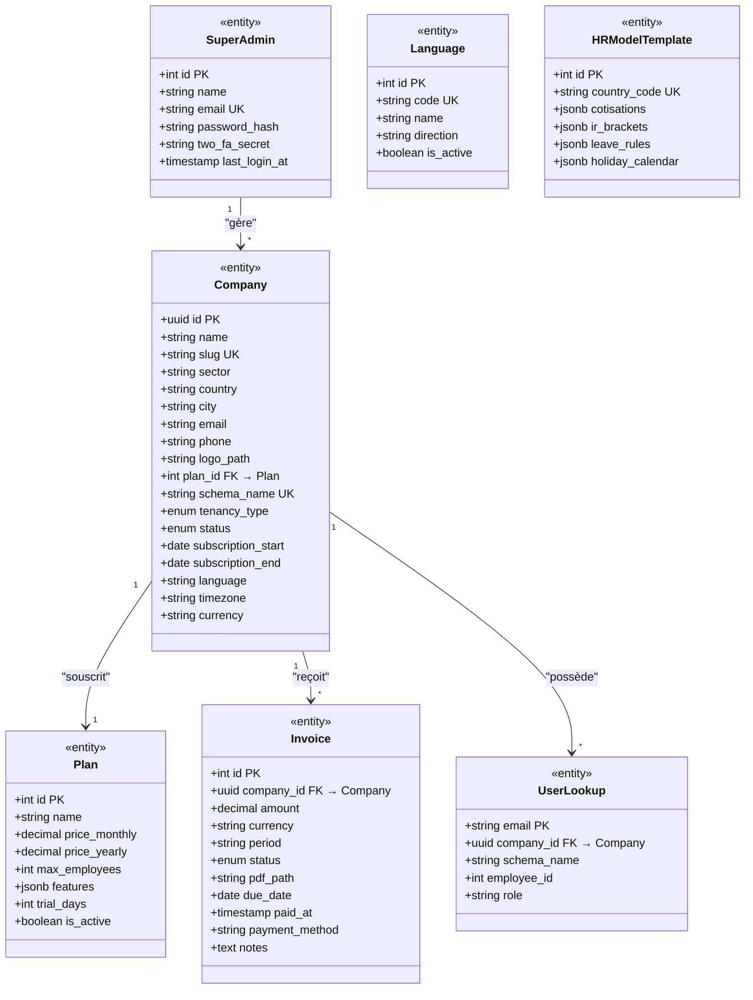

# Diagramme de Classes — Modèles Principaux

> **Projet :** Leopardo RH v3.3.3
> **Date :** 2025
> **Statut :** Dossier de Conception — Diagrammes UML

Ce document présente le diagramme de classes de l'ensemble des modèles du système Leopardo RH, modélisé en syntaxe Mermaid `classDiagram`. Les classes sont organisées en deux groupes : **Schéma Public** (multi-tenant) et **Schéma Locataire** (données métier).

---

## Vue d'ensemble — Schéma Public

Le schéma `public` contient les entités de gestion multi-tenant : abonnements, entreprises, facturation, administration.



### Relations du schéma public

| Relation | Cardinalité | Description |
|---|---|---|
| `Company → Plan` | N:1 | Chaque entreprise souscrit à un plan |
| `Company → Invoice` | 1:N | Une entreprise reçoit plusieurs factures |
| `Company → UserLookup` | 1:N | Lookup rapide email → schéma locataire |
| `SuperAdmin → Company` | 1:N | Un super-admin gère plusieurs entreprises |

---

## Vue d'ensemble — Schéma Locataire

Le schéma locataire (`tenant_{id}` ou dédié) contient toutes les données métier RH.

```mermaid
classDiagram
    %% ============================================================
    %% SCHÉMA LOCATAIRE — Modèles Métier RH
    %% ============================================================

    %% ─── Organigramme ────────────────────────────────────────────

    class Employee {
        <<entity>>
        +int id PK
        +string matricule UK
        +int zkteco_id
        +string first_name
        +string last_name
        +string email
        +string phone
        +string password_hash
        +enum role
        +enum manager_role
        +int department_id FK
        +int position_id FK
        +int schedule_id FK
        +int manager_id FK → Employee
        +int site_id FK
        +decimal salary_base
        +enum status
        +decimal leave_balance
        +string photo_path
        +jsonb emergency_contact
    }

    class Department {
        <<entity>>
        +int id PK
        +string name
        +int manager_id FK → Employee
    }

    class Position {
        <<entity>>
        +int id PK
        +string name
        +int department_id FK → Department
    }

    class Schedule {
        <<entity>>
        +int id PK
        +string name
        +time start_time
        +time end_time
        +int break_minutes
        +jsonb work_days
        +int late_tolerance_minutes
        +int overtime_threshold_daily
        +int overtime_threshold_weekly
        +boolean is_default
    }

    class Site {
        <<entity>>
        +int id PK
        +string name
        +string address
        +decimal gps_lat
        +decimal gps_lng
        +int gps_radius_m
    }

    %% ─── Appareils & Pointage ───────────────────────────────────

    class Device {
        <<entity>>
        +int id PK
        +string name
        +string model
        +string serial_number UK
        +enum type
        +int site_id FK → Site
        +string token
        +timestamp last_sync_at
        +enum status
    }

    class EmployeeDevice {
        <<entity>>
        +int id PK
        +int employee_id FK → Employee
        +string fcm_token
        +enum platform
        +string device_name
        +timestamp last_seen
    }

    class AttendanceLog {
        <<entity>>
        +bigint id PK
        +int employee_id FK → Employee
        +date date
        +int session_number
        +time check_in
        +time check_out
        +enum method
        +decimal gps_lat
        +decimal gps_lng
        +decimal hours_worked
        +decimal overtime_hours
        +enum status
        +boolean is_manual_edit
    }

    %% ─── Absences & Congés ──────────────────────────────────────

    class AbsenceType {
        <<entity>>
        +int id PK
        +string label
        +boolean is_paid
        +decimal pay_rate
        +boolean deducts_leave
        +boolean requires_justification
        +int min_notice_days
        +int max_days
        +enum who_submits
        +string color
    }

    class Absence {
        <<entity>>
        +int id PK
        +int employee_id FK → Employee
        +int type_id FK → AbsenceType
        +date start_date
        +date end_date
        +decimal days_count
        +enum status
        +text comment
        +int decided_by FK → Employee
        +text decision_comment
    }

    class LeaveBalanceLog {
        <<entity>>
        +int id PK
        +int employee_id FK → Employee
        +string type
        +decimal days
        +decimal balance_after
        +int reference_id
        +int created_by FK → Employee
        +string note
    }

    %% ─── Avances sur Salaire ────────────────────────────────────

    class SalaryAdvance {
        <<entity>>
        +int id PK
        +int employee_id FK → Employee
        +decimal amount
        +text reason
        +enum status
        +jsonb repayment_plan
        +decimal amount_remaining
        +int approved_by FK → Employee
        +text decision_comment
    }

    %% ─── Projets & Tâches ───────────────────────────────────────

    class Project {
        <<entity>>
        +int id PK
        +string name
        +text description
        +date start_date
        +date end_date
        +jsonb members
        +enum status
        +int created_by FK → Employee
    }

    class Task {
        <<entity>>
        +int id PK
        +string title
        +text description
        +int created_by FK → Employee
        +jsonb assigned_to
        +int project_id FK → Project
        +date due_date
        +enum priority
        +enum status
        +string category
        +jsonb checklist
        +enum visibility
    }

    class TaskComment {
        <<entity>>
        +int id PK
        +int task_id FK → Task
        +int author_id FK → Employee
        +text content
        +string attachment_path
    }

    %% ─── Évaluations ────────────────────────────────────────────

    class Evaluation {
        <<entity>>
        +int id PK
        +int employee_id FK → Employee
        +int evaluator_id FK → Employee
        +string period
        +jsonb criteria_scores
        +decimal global_score
        +text comment
        +text objectives
        +jsonb self_evaluation
    }

    %% ─── Paie ───────────────────────────────────────────────────

    class Payroll {
        <<entity>>
        +bigint id PK
        +int employee_id FK → Employee
        +int period_month
        +int period_year
        +decimal gross_salary
        +decimal overtime_amount
        +jsonb bonuses
        +jsonb deductions
        +jsonb cotisations
        +decimal ir_amount
        +decimal advance_deduction
        +decimal absence_deduction
        +decimal net_salary
        +string pdf_path
        +enum status
        +int validated_by FK → Employee
    }

    class PayrollExportBatch {
        <<entity>>
        +int id PK
        +int period_month
        +int period_year
        +enum status
        +string file_path
        +int created_by FK → Employee
    }

    class PayrollExportItem {
        <<entity>>
        +int id PK
        +int batch_id FK → PayrollExportBatch
        +int payroll_id FK → Payroll
        +int row_number
    }

    %% ─── Paramètres & Audit ─────────────────────────────────────

    class CompanySetting {
        <<entity>>
        +string key PK
        +text value
        +string value_type
    }

    class AuditLog {
        <<entity>>
        +bigint id PK
        +string actor_type
        +int actor_id
        +string actor_name
        +string action
        +string table_name
        +int record_id
        +jsonb old_values
        +jsonb new_values
        +string ip
        +string user_agent
    }

    class Notification {
        <<entity>>
        +bigint id PK
        +int recipient_id FK → Employee
        +string type
        +string title
        +string body
        +jsonb data
        +timestamp read_at
    }

    %% ============================================================
    %% RELATIONS — Organigramme
    %% ============================================================

    Department "1" --> "1" Employee : "manager (manager_id)"
    Department "1" --> "*" Employee : "emploie"
    Department "1" --> "*" Position : "contient"

    Employee "1" --> "1" Department : "appartient à"
    Employee "1" --> "1" Position : "occupe"
    Employee "1" --> "1" Schedule : "suit"
    Employee "1" --> "1" Site : "affecté à"
    Employee "N" --> "1" Employee : "reporte à (manager_id)"

    Site "1" --> "*" Device : "héberge"
    Site "1" --> "*" Employee : "accueille"

    %% ============================================================
    %% RELATIONS — Pointage & Appareils
    %% ============================================================

    Employee "1" --> "*" AttendanceLog : "pointe dans"
    Employee "1" --> "*" EmployeeDevice : "utilise"

    %% ============================================================
    %% RELATIONS — Absences & Congés
    %% ============================================================

    AbsenceType "1" --> "*" Absence : "catégorise"
    Employee "1" --> "*" Absence : "dépose"
    Employee "1" --> "*" Absence : "décide (decided_by)"
    Employee "1" --> "*" LeaveBalanceLog : "historique solde"
    Employee "1" --> "*" LeaveBalanceLog : "créé par (created_by)"

    %% ============================================================
    %% RELATIONS — Avances
    %% ============================================================

    Employee "1" --> "*" SalaryAdvance : "demande"
    Employee "1" --> "*" SalaryAdvance : "approuve (approved_by)"

    %% ============================================================
    %% RELATIONS — Projets & Tâches
    %% ============================================================

    Employee "1" --> "*" Project : "crée (created_by)"
    Project "1" --> "*" Task : "contient"
    Employee "1" --> "*" Task : "crée (created_by)"
    Task "1" --> "*" TaskComment : "reçoit"
    Employee "1" --> "*" TaskComment : "rédige (author_id)"

    %% ============================================================
    %% RELATIONS — Évaluations
    %% ============================================================

    Employee "1" --> "*" Evaluation : "évalué (employee_id)"
    Employee "1" --> "*" Evaluation : "évaluateur (evaluator_id)"

    %% ============================================================
    %% RELATIONS — Paie
    %% ============================================================

    Employee "1" --> "*" Payroll : "reçoit"
    Employee "1" --> "*" Payroll : "valide (validated_by)"
    PayrollExportBatch "1" --> "*" PayrollExportItem : "contient"
    Payroll "1" --> "*" PayrollExportItem : "exporté dans"

    %% ============================================================
    %% RELATIONS — Paramètres & Audit
    %% ============================================================

    Employee "1" --> "*" Notification : "reçoit (recipient_id)"
```



---

## Relations détaillées

### Organigramme

| De | Vers | Type | Description |
|---|---|---|---|
| `Employee.department_id` | `Department` | N:1 | Un employé appartient à un département |
| `Employee.position_id` | `Position` | N:1 | Un employé occupe un poste |
| `Employee.schedule_id` | `Schedule` | N:1 | Un employé suit un horaire |
| `Employee.manager_id` | `Employee` | N:1 | Référence récursive (hiérarchie) |
| `Employee.site_id` | `Site` | N:1 | Affectation géographique |
| `Department.manager_id` | `Employee` | N:1 | Chef de département |
| `Position.department_id` | `Department` | N:1 | Un poste rattaché à un département |

### Pointage

| De | Vers | Type | Description |
|---|---|---|---|
| `AttendanceLog.employee_id` | `Employee` | N:1 | Journal de pointage d'un employé |
| `EmployeeDevice.employee_id` | `Employee` | N:1 | Appareils mobiles enregistrés |
| `Device.site_id` | `Site` | N:1 | Terminal physique rattaché à un site |

### Absences & Congés

| De | Vers | Type | Description |
|---|---|---|---|
| `Absence.employee_id` | `Employee` | N:1 | Demande d'absence d'un employé |
| `Absence.type_id` | `AbsenceType` | N:1 | Type d'absence (congé, maladie…) |
| `Absence.decided_by` | `Employee` | N:1 | Manager ayant décidé |
| `LeaveBalanceLog.employee_id` | `Employee` | N:1 | Historique du solde de congés |
| `LeaveBalanceLog.created_by` | `Employee` | N:1 | Auteur de la modification |

### Paie

| De | Vers | Type | Description |
|---|---|---|---|
| `Payroll.employee_id` | `Employee` | N:1 | Bulletin de paie d'un employé |
| `Payroll.validated_by` | `Employee` | N:1 | Validateur du bulletin |
| `PayrollExportItem.batch_id` | `PayrollExportBatch` | N:1 | Lot d'export |
| `PayrollExportItem.payroll_id` | `Payroll` | N:1 | Bulletin exporté |

### Projets & Tâches

| De | Vers | Type | Description |
|---|---|---|---|
| `Task.project_id` | `Project` | N:1 | Tâche rattachée à un projet |
| `Task.created_by` | `Employee` | N:1 | Créateur de la tâche |
| `TaskComment.task_id` | `Task` | N:1 | Commentaire sur une tâche |
| `TaskComment.author_id` | `Employee` | N:1 | Auteur du commentaire |

---

## Types énumérés (Enums)

| Enum | Valeurs |
|---|---|
| `Company.tenancy_type` | `shared`, `dedicated` |
| `Company.status` | `active`, `suspended`, `trial` |
| `Employee.status` | `active`, `suspended`, `archived` |
| `Employee.role` | `admin`, `rh`, `manager`, `employee` |
| `Employee.manager_role` | `none`, `department_manager`, `site_manager` |
| `Device.type` | `zkteco`, `mobile_gps` |
| `AttendanceLog.method` | `zkteco`, `gps`, `manual` |
| `AttendanceLog.status` | `incomplete`, `ontime`, `late`, `absent`, `leave`, `holiday` |
| `Absence.status` | `pending`, `approved`, `rejected`, `cancelled` |
| `SalaryAdvance.status` | `pending`, `approved`, `active`, `repaid`, `rejected` |
| `Payroll.status` | `draft`, `validated` |
| `Task.priority` | `low`, `medium`, `high`, `urgent` |
| `Task.status` | `todo`, `in_progress`, `done`, `cancelled` |
| `Task.visibility` | `all`, `assigned`, `creator` |
| `Project.status` | `active`, `completed`, `on_hold`, `cancelled` |
| `Invoice.status` | `pending`, `paid`, `overdue`, `cancelled` |

---

## Champs JSONB — Structure

Les champs de type `JSONB` stockent des données structurées flexibles. Voici leur schéma attendu :

### `Employee.emergency_contact`
```json
{
  "name": "Ahmed Benali",
  "relationship": "frère",
  "phone": "+213 555 123 456"
}
```

### `Schedule.work_days`
```json
[1, 2, 3, 4, 5]
```
*(1=Lundi, …, 5=Vendredi)*

### `SalaryAdvance.repayment_plan`
```json
{
  "monthly_amount": 15000.00,
  "months": 3,
  "start_period": "2025-08",
  "end_period": "2025-10"
}
```

### `Payroll.bonuses` / `Payroll.deductions`
```json
{
  "prime_responsabilite": 10000.00,
  "prime_transport": 5000.00
}
```

### `Payroll.cotisations`
```json
{
  "cnas_employe": 6750.00,
  "cnas_employeur": 17550.00,
  "casnos": 1350.00,
  "mutuelle": 3000.00
}
```

### `Evaluation.criteria_scores`
```json
{
  "competence": 4,
  "ponctualite": 5,
  "travail_equipe": 3,
  "initiative": 4,
  "resultats": 4
}
```

### `Task.checklist`
```json
[
  { "label": "Rédiger le cahier des charges", "done": true },
  { "label": "Valider avec le client", "done": false }
]
```

### `Task.assigned_to`
```json
[12, 15, 23]
```
*(Liste d'IDs employés)*

### `Project.members`
```json
[12, 15, 18, 23, 45]
```
*(Liste d'IDs employés)*
