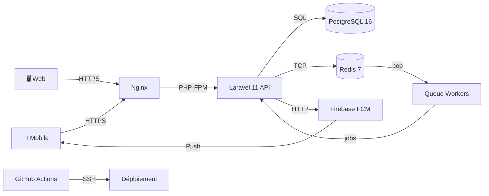

# Diagramme de Déploiement — Architecture Infrastructure

> **Projet :** Leopardo RH v3.3.3
> **Date :** 2025
> **Statut :** Dossier de Conception — Diagrammes UML

Ce document présente l'architecture de déploiement de la plateforme Leopardo RH, modélisée en syntaxe Mermaid `flowchart`. Il couvre l'ensemble des composants d'infrastructure, le flux de données et les connexions réseau.

---

## Vue d'ensemble — Architecture complète

```mermaid
flowchart TB
    %% ============================================================
    %% DIAGRAMME DE DÉPLOIEMENT — Leopardo RH
    %% Hébergement : o2switch (shared hosting / VPS)
    %% ============================================================

    %% ─── UTILISATEURS (Externes) ───────────────────────────────

    subgraph Users["👥 Utilisateurs"]
        direction LR
        Mobile["📱 Utilisateurs Mobile\nFlutter App\nAndroid / iOS"]
        Web["🖥️ Utilisateurs Web\nVue.js + Inertia.js\nNavigateur"]
    end

    %% ─── DNS & RÉSEAU ─────────────────────────────────────────

    subgraph DNS["🌐 DNS & Routage"]
        direction LR
        DNSRecord["api.leopardo-rh.com\nDNS A Record"]
        CDN["Cloudflare\nCDN + SSL/TLS"]
    end

    %% ─── CI/CD ────────────────────────────────────────────────

    subgraph CI_CD["🔄 GitHub Actions — CI/CD"]
        direction TB
        GitHub["GitHub Repository\nleopardo-rh/backend"]
        TestJob["tests.yml\nPHPUnit + Pint\nPHPStan"]
        DeployJob["deploy.yml\nSSH → Serveur\nrsync + artisan migrate"]
        GitHub --> TestJob
        TestJob --> DeployJob
    end

    %% ─── SERVEUR o2switch ─────────────────────────────────────

    subgraph Server["🖥️ Serveur o2switch — Hébergement Principal"]
        direction TB

        subgraph WebLayer["Couche Web — Reverse Proxy"]
            Nginx["Nginx\nReverse Proxy\nPort 80/443"]
        end

        subgraph AppLayer["Couche Application — PHP"]
            PHPFPM["PHP-FPM 8.3\nLaravel 11\nSanctum Auth"]
        end

        subgraph WorkerLayer["Couche Asynchrone — Queue Workers"]
            Supervisor["Supervisor\nProcess Manager"]
            QueueWorker["Queue Worker\nRedis Driver"]
            JobPDF["GeneratePayslipPdfJob"]
            JobEmail["SendNotificationEmailJob"]
            JobSync["SyncZktecoAttendanceJob"]
            Supervisor --> QueueWorker
            QueueWorker --> JobPDF
            QueueWorker --> JobEmail
            QueueWorker --> JobSync
        end

        subgraph CronLayer["Planification — Cron"]
            Cron["Cron (crontab)\nLaravel Scheduler"]
            CronCloseDay["attendance:close-day"]
            CronAbsence["absence:auto-reject"]
            CronTrial["subscription:check-trial"]
            Cron --> CronCloseDay
            Cron --> CronAbsence
            Cron --> CronTrial
        end

        subgraph StorageLayer["Couche Stockage"]
            LocalStorage["Stockage Local\n/storage/app"]
            StorageLink["symlink\npublic/storage"]
        end

        subgraph DBLayer["Couche Données"]
            PostgreSQL["PostgreSQL 16\nPort 5432"]
            PGPublic["Schema : public\nPlans, Companies,\nSuperAdmins, Invoices"]
            PGTenant["Schema : tenant_* \nEmployees, Payrolls,\nAttendance, etc."]
            PostgreSQL --> PGPublic
            PostgreSQL --> PGTenant
        end

        subgraph CacheLayer["Couche Cache & Sessions"]
            Redis["Redis 7\nPort 6379"]
            RedisCache["Cache\nConfig, Settings"]
            RedisSession["Sessions\nSanctum Tokens"]
            RedisQueue["Queue\nJobs Pending"]
            Redis --> RedisCache
            Redis --> RedisSession
            Redis --> RedisQueue
        end
    end

    %% ─── SERVICES EXTERNES ────────────────────────────────────

    subgraph External["☁️ Services Externes"]
        direction TB
        FCM["Firebase Cloud Messaging\nPush Notifications\n→ Appareils Mobile"]
        SMTP["SMTP / Mail\nEnvoi d'emails\nNotifications"]
        ZKTeco["ZKTeco\nTerminaux biométriques\nPointage"]
    end

    %% ============================================================
    %% CONNEXIONS — Flux de données
    %% ============================================================

    %% Utilisateurs → DNS → Nginx
    Mobile -->|HTTPS / REST API| CDN
    Web -->|HTTPS / Inertia| CDN
    CDN -->|A Record| DNSRecord
    DNSRecord -->|Reverse Proxy| Nginx

    %% CI/CD → Serveur
    DeployJob -->|SSH + rsync\nDéploiement| Nginx

    %% Nginx → Application
    Nginx -->|FastCGI| PHPFPM

    %% Application → Données
    PHPFPM -->|Eloquent ORM\nQuery Builder| PostgreSQL
    PHPFPM -->|phpredis| Redis
    PHPFPM -->|Filesystem| LocalStorage
    LocalStorage --> StorageLink

    %% Queue Workers → Données
    QueueWorker -->|Accès DB| PostgreSQL
    QueueWorker -->|Accès Cache| Redis

    %% Cron → Application
    Cron -->|Artisan Commands| PHPFPM

    %% Application → Services Externes
    PHPFPM -->|HTTP API\nEnvoi push| FCM
    FCM -->|APNs / FCM\nNotification push| Mobile

    PHPFPM -->|SMTP\nEnvoi emails| SMTP
    SMTP -->|Email\nNotification| Mobile
    SMTP -->|Email\nNotification| Web

    PHPFPM -->|SDK TCP/IP\nSynchronisation| ZKTeco
    ZKTeco -->|Webhook / Poll\nDonnées pointage| QueueWorker

    %% Styles
    style Mobile fill:#4FC3F7,stroke:#0288D1,color:#000
    style Web fill:#4FC3F7,stroke:#0288D1,color:#000
    style Nginx fill:#81C784,stroke:#388E3C,color:#000
    style PHPFPM fill:#FF8A65,stroke:#E64A19,color:#000
    style PostgreSQL fill:#CE93D8,stroke:#7B1FA2,color:#000
    style Redis fill:#EF5350,stroke:#C62828,color:#000
    style Supervisor fill:#FFB74D,stroke:#F57C00,color:#000
    style FCM fill:#FFF176,stroke:#F9A825,color:#000
    style GitHub fill:#78909C,stroke:#37474F,color:#000
    style DNSRecord fill:#90CAF9,stroke:#1565C0,color:#000
    style CDN fill:#90CAF9,stroke:#1565C0,color:#000
```



---

## Flux de communication détaillé

### 1. Authentification Multi-Tenant

```
Navigateur/App → HTTPS → Nginx → Laravel API
    ↓
Sanctum vérifie le token → UserLookup (public.company_email)
    ↓
Récupération schema_name → Connection PDO vers tenant schema
    ↓
Employee loaded from tenant schema → Authentifié
```

| Étape | Composant | Action |
|---|---|---|
| 1 | Client | Envoi token Bearer dans `Authorization` header |
| 2 | Nginx | Route vers PHP-FPM via `location ~ \.php$` |
| 3 | Laravel Middleware | Vérifie token Sanctum (table `personal_access_tokens`) |
| 4 | UserLookup | Requête `public.user_lookup` → obtient `schema_name` |
| 5 | Tenancy Middleware | Bascule connexion PDO vers `schema_name` |
| 6 | Controller | Accède aux données dans le schéma locataire |

### 2. Pointage en Temps Réel

```
Terminal ZKTeco → SyncZktecoAttendanceJob → PostgreSQL (tenant)
    ↓
AttendanceLog.created → Event dispatched
    ↓
Event → Status calculated (ontime/late/absent)
    ↓
Notification → FCM → Mobile Push
```

| Étape | Composant | Action |
|---|---|---|
| 1 | ZKTeco | Données pointage disponibles |
| 2 | Queue Worker | `SyncZktecoAttendanceJob` récupère les données |
| 3 | PostgreSQL | Insertion `attendance_logs` dans schéma locataire |
| 4 | Event | `AttendanceLogCreated` dispatché |
| 5 | Listener | Calcul du statut selon horaire + tolérance |
| 6 | FCM | Push notification envoyée à l'employé |

### 3. Génération de Bulletin de Paie

```
Admin → POST /payroll/validate → Laravel API
    ↓
PayrollService.calculateForEmployee()
    ↓
Payroll status = validated → GeneratePayslipPdfJob (queued)
    ↓
Supervisor → Queue Worker → PDF généré (DomPDF)
    ↓
PDF stored → Notification.email + Notification.push
```

| Étape | Composant | Action |
|---|---|---|
| 1 | Web Admin | `POST /payroll/validate` |
| 2 | Laravel | `PayrollService::validate()` |
| 3 | Redis Queue | Job `GeneratePayslipPdfJob` enqueued |
| 4 | Supervisor | Déclenche le worker |
| 5 | Queue Worker | Exécute le job → DomPDF → stockage |
| 6 | Laravel | Notification email + push envoyées |

### 4. Déploiement CI/CD

```
git push origin main → GitHub Actions → tests.yml
    ↓
PHPUnit tests → PHPStan analyse → Pint linting
    ↓
All passed → deploy.yml → SSH vers serveur o2switch
    ↓
rsync code → artisan migrate → artisan config:cache
    ↓
Supervisor restart → Queue workers relancés
```

| Étape | Composant | Action |
|---|---|---|
| 1 | Developer | `git push origin main` |
| 2 | GitHub Actions | Déclenche `tests.yml` |
| 3 | Runner | PHPUnit + PHPStan + Pint |
| 4 | GitHub Actions | Déclenche `deploy.yml` si tests OK |
| 5 | Runner | SSH vers serveur o2switch |
| 6 | Serveur | `rsync` des fichiers + `artisan migrate` |

---

## Composants d'infrastructure

### Serveur — o2switch

| Composant | Version | Rôle |
|---|---|---|
| **Nginx** | 1.24+ | Reverse proxy, SSL termination, fichiers statiques |
| **PHP-FPM** | 8.3 | Exécution du code Laravel |
| **Laravel** | 11.x | Framework applicatif (API + Inertia) |
| **PostgreSQL** | 16.x | Base de données relationnelle (multi-schema) |
| **Redis** | 7.x | Cache, sessions, queue driver |
| **Supervisor** | 4.x | Gestion des workers de queue |

### Services Externes

| Service | Rôle | Protocole |
|---|---|---|
| **Firebase FCM** | Push notifications mobile | HTTP API |
| **SMTP** | Envoi d'emails transactionnels | SMTP |
| **ZKTeco** | Terminaux biométriques de pointage | SDK TCP/IP |
| **Cloudflare** | CDN + SSL/TLS + DDoS protection | HTTPS |
| **GitHub** | Dépôt source + CI/CD | Git + SSH |

### DNS & Routage

| Entrée DNS | Type | Destination |
|---|---|---|
| `api.leopardo-rh.com` | A Record | IP serveur o2switch |
| `app.leopardo-rh.com` | A Record | IP serveur o2switch |
| `*.leopardo-rh.com` | CNAME | Cloudflare proxy |

### Nginx — Configuration (simplifiée)

```nginx
server {
    listen 443 ssl http2;
    server_name api.leopardo-rh.com;

    ssl_certificate     /etc/ssl/leopardo-rh/fullchain.pem;
    ssl_certificate_key /etc/ssl/leopardo-rh/privkey.pem;

    root /home/leopardo/public;
    index index.php;

    location / {
        try_files $uri $uri/ /index.php?$query_string;
    }

    location ~ \.php$ {
        fastcgi_pass unix:/run/php/php8.3-fpm.sock;
        fastcgi_param SCRIPT_FILENAME $realpath_root$fastcgi_script_name;
        include fastcgi_params;
    }

    # Fichiers statiques — cache navigateur
    location ~* \.(js|css|png|jpg|jpeg|gif|ico|svg|woff2)$ {
        expires 1y;
        add_header Cache-Control "public, immutable";
    }
}
```

### Supervisor — Configuration Workers

```ini
[program:leopardo-queue]
process_name=%(program_name)s_%(process_num)02d
command=php /home/leopardo/artisan queue:work redis --sleep=3 --tries=3 --max-time=3600
autostart=true
autorestart=true
stopasgroup=true
killasgroup=true
user=leopardo
numprocs=3
redirect_stderr=true
stdout_logfile=/home/leopardo/storage/logs/worker.log
stopwaitsecs=3600
```

### Cron — Planification Laravel

```cron
* * * * * cd /home/leopardo && php artisan schedule:run >> /dev/null 2>&1
```

| Tâche planifiée | Fréquence | Description |
|---|---|---|
| `attendance:close-day` | Quotidien 23:00 | Clôture des pointages, détection absences |
| `absence:auto-reject` | Quotidien 00:00 | Rejet automatique des absences non traitées (>7j) |
| `subscription:check-trial` | Quotidien 08:00 | Vérification fins de période d'essai |

---

## Vue simplifiée — Flux principal


