# Diagramme de Cas d'Utilisation — Leopardo RH

> **Projet :** Leopardo RH v3.3.3
> **Date :** 2025
> **Statut :** Dossier de Conception — Diagrammes UML

Ce document présente le diagramme de cas d'utilisation complet de la plateforme SaaS Leopardo RH. Le système est modélisé en syntaxe Mermaid `flowchart` avec représentation des **7 acteurs**, de la frontière système et des cas d'utilisation regroupés par module fonctionnel. Chaque acteur interagit avec le système via l'API REST ou l'interface mobile Flutter selon son rôle et ses permissions.

---

## Vue d'ensemble — Diagramme Use Case

```mermaid
flowchart TB
    %% ============================================================
    %% DIAGRAMME DE CAS D'UTILISATION — Leopardo RH v3.3.3
    %% Représentation flowchart UML Use Case
    %% ============================================================

    %% ─── ACTEURS ─────────────────────────────────────────────

    Emp["👤 Employé\nFlutter Mobile"]
    Mgr["👔 Manager Département\nMobile + Web"]
    RH["📋 Responsable RH\nWeb"]
    Cpt["🧾 Comptable\nWeb"]
    Sup["👁️ Superviseur\nMobile"]
    GP["⚙️ Gestionnaire Principal\nWeb"]
    SA["🛡️ Super Admin\nWeb"]

    %% ─── FRONTIÈRE SYSTÈME ──────────────────────────────────

    subgraph SYS["🖥️ SYSTÈME LEOPARDO RH — Plateforme SaaS Multi-Tenant"]

        %% ─── MODULE AUTH ─────────────────────────────────────
        subgraph AUTH["🔐 Authentification"]
            UC_Login["UC1 : Se connecter\nPOST /auth/login"]
            UC_Logout["UC2 : Se déconnecter\nPOST /auth/logout"]
            UC_Forgot["UC3 : Mot de passe oublié\nPOST /auth/forgot-password"]
            UC_2FA["UC4 : Authentification 2FA\nGET /auth/2fa/verify"]
        end

        %% ─── MODULE POINTAGE ────────────────────────────────
        subgraph ATT["⏰ Pointage (Attendance)"]
            UC_CheckIn["UC5 : Check-in\nPOST /attendance/check-in"]
            UC_CheckOut["UC6 : Check-out\nPOST /attendance/check-out"]
            UC_QR["UC7 : Scanner QR Code\nPOST /attendance/qr-scan"]
            UC_Bio["UC8 : Sync Biométrique\nPOST /attendance/zkteco-sync"]
            UC_Edit["UC9 : Édition manuelle\nPUT /attendance/{id}"]
            UC_Close["UC10 : Clôture journalière\nCMD attendance:close-day"]
        end

        %% ─── MODULE ABSENCES ────────────────────────────────
        subgraph ABS["📅 Absences & Congés"]
            UC_ReqAbs["UC11 : Demander absence\nPOST /absences"]
            UC_ApprAbs["UC12 : Approuver absence\nPUT /absences/{id}/approve"]
            UC_RejAbs["UC13 : Rejeter absence\nPUT /absences/{id}/reject"]
            UC_CancelAbs["UC14 : Annuler absence\nPUT /absences/{id}/cancel"]
            UC_AutoRej["UC15 : Auto-rejet cron\nCMD absence:auto-reject"]
        end

        %% ─── MODULE AVANCES ─────────────────────────────────
        subgraph ADV["💰 Avances sur Salaire"]
            UC_ReqAdv["UC16 : Demander avance\nPOST /salary-advances"]
            UC_ApprAdv["UC17 : Approuver avance\nPUT /salary-advances/{id}/approve"]
            UC_RejAdv["UC18 : Rejeter avance\nPUT /salary-advances/{id}/reject"]
            UC_AutoDed["UC19 : Déduction auto paie\nIncluded in payroll calc"]
        end

        %% ─── MODULE PAIE ────────────────────────────────────
        subgraph PAY["💸 Paie (Payroll)"]
            UC_Calc["UC20 : Calculer paie\nPOST /payroll/calculate"]
            UC_ValPay["UC21 : Valider bulletin\nPUT /payroll/{id}/validate"]
            UC_PDF["UC22 : Générer PDF\nPOST /payroll/generate-pdf"]
            UC_Bank["UC23 : Export bancaire\nPOST /payroll/export-bank"]
        end

        %% ─── MODULE TÂCHES ──────────────────────────────────
        subgraph TSK["📝 Tâches & Projets"]
            UC_CreateTask["UC24 : Créer tâche\nPOST /tasks"]
            UC_AssignTask["UC25 : Assigner tâche\nPUT /tasks/{id}/assign"]
            UC_Comment["UC26 : Commenter\nPOST /tasks/{id}/comments"]
            UC_Status["UC27 : Changer statut\nPUT /tasks/{id}/status"]
            UC_Kanban["UC28 : Vue Kanban\nGET /tasks?view=kanban"]
        end

        %% ─── MODULE EMPLOYÉS ────────────────────────────────
        subgraph EMP["👥 Gestion Employés"]
            UC_CRUDEmp["UC29 : CRUD employés\nGET/POST/PUT/DELETE /employees"]
            UC_Import["UC30 : Import CSV\nPOST /employees/import"]
            UC_Archive["UC31 : Archiver employé\nPUT /employees/{id}/archive"]
            UC_Suspend["UC32 : Suspendre employé\nPUT /employees/{id}/suspend"]
        end

        %% ─── MODULE CONFIG ──────────────────────────────────
        subgraph CFG["⚙️ Configuration"]
            UC_Dept["UC33 : Gérer départements\nGET/POST/PUT/DELETE /departments"]
            UC_Pos["UC34 : Gérer postes\nGET/POST/PUT/DELETE /positions"]
            UC_Sched["UC35 : Gérer horaires\nGET/POST/PUT/DELETE /schedules"]
            UC_Site["UC36 : Gérer sites\nGET/POST/PUT/DELETE /sites"]
            UC_Settings["UC37 : Paramètres société\nGET/PUT /settings"]
        end

        %% ─── MODULE NOTIFICATIONS ───────────────────────────
        subgraph NOTIF["🔔 Notifications"]
            UC_Push["UC38 : Push FCM\nQueue: SendPushJob"]
            UC_Email["UC39 : Email SMTP\nQueue: SendEmailJob"]
            UC_SSE["UC40 : SSE temps réel\nGET /notifications/stream"]
        end

        %% ─── MODULE SUPER ADMIN ─────────────────────────────
        subgraph SADMIN["🛡️ Super Admin"]
            UC_CompCRUD["UC41 : CRUD entreprises\nGET/POST/PUT/DELETE /sa/companies"]
            UC_PlanCRUD["UC42 : CRUD plans\nGET/POST/PUT/DELETE /sa/plans"]
            UC_Invoice["UC43 : Gérer factures\nGET/POST /sa/invoices"]
            UC_Lang["UC44 : Gérer langues\nGET/POST/PUT/DELETE /sa/languages"]
            UC_HRModel["UC45 : Modèles RH\nGET/POST/PUT/DELETE /sa/hr-models"]
            UC_Audit["UC46 : Journaux d'audit\nGET /sa/audit-logs"]
        end

        %% ─── MODULE FACTURATION ─────────────────────────────
        subgraph BILL["💳 Facturation"]
            UC_Stripe["UC47 : Webhook Stripe\nPOST /webhooks/stripe"]
            UC_Paydunya["UC48 : Webhook Paydunya\nPOST /webhooks/paydunya"]
            UC_ManPay["UC49 : Paiement manuel\nPOST /sa/invoices/{id}/pay-manual"]
        end

    end

    %% ============================================================
    %% CONNEXIONS ACTEURS → CAS D'UTILISATION
    %% ============================================================

    %% --- Employé ---
    Emp --> UC_Login
    Emp --> UC_Logout
    Emp --> UC_Forgot
    Emp --> UC_CheckIn
    Emp --> UC_CheckOut
    Emp --> UC_QR
    Emp --> UC_ReqAbs
    Emp --> UC_CancelAbs
    Emp --> UC_ReqAdv
    Emp --> UC_Kanban
    Emp --> UC_SSE
    Emp --> UC_Push

    %% --- Manager Département ---
    Mgr --> UC_Login
    Mgr --> UC_CheckIn
    Mgr --> UC_CheckOut
    Mgr --> UC_ApprAbs
    Mgr --> UC_AssignTask
    Mgr --> UC_CreateTask
    Mgr --> UC_Kanban
    Mgr --> UC_Comment
    Mgr --> UC_Edit
    Emp -.->|<<extends>>| Mgr

    %% --- Responsable RH ---
    RH --> UC_CRUDEmp
    RH --> UC_Import
    RH --> UC_Archive
    RH --> UC_Suspend
    RH --> UC_ApprAbs
    RH --> UC_RejAbs
    RH --> UC_Dept
    RH --> UC_Pos
    RH --> UC_Sched
    RH --> UC_Site
    RH --> UC_Settings

    %% --- Comptable ---
    Cpt --> UC_Calc
    Cpt --> UC_ValPay
    Cpt --> UC_PDF
    Cpt --> UC_Bank

    %% --- Superviseur ---
    Sup --> UC_Login
    Sup --> UC_Kanban
    Sup --> UC_ApprAbs
    Sup --> UC_SSE

    %% --- Gestionnaire Principal ---
    GP --> UC_CRUDEmp
    GP --> UC_Import
    GP --> UC_Archive
    GP --> UC_Suspend
    GP --> UC_Calc
    GP --> UC_ValPay
    GP --> UC_PDF
    GP --> UC_Bank
    GP --> UC_Dept
    GP --> UC_Pos
    GP --> UC_Sched
    GP --> UC_Site
    GP --> UC_Settings
    GP --> UC_Edit
    GP --> UC_Close
    GP --> UC_RejAdv
    GP --> UC_ApprAdv

    %% --- Super Admin ---
    SA --> UC_Login
    SA --> UC_2FA
    SA --> UC_CompCRUD
    SA --> UC_PlanCRUD
    SA --> UC_Invoice
    SA --> UC_Lang
    SA --> UC_HRModel
    SA --> UC_Audit
    SA --> UC_Stripe
    SA --> UC_Paydunya
    SA --> UC_ManPay

    %% ============================================================
    %% RELATIONS D'HÉRITAGE ENTRE ACTEURS
    %% ============================================================

    Mgr -.->|<<inherits>>| RH
    RH -.->|<<inherits>>| GP

    %% Styles
    style Emp fill:#4FC3F7,stroke:#0288D1,color:#000
    style Mgr fill:#81C784,stroke:#388E3C,color:#000
    style RH fill:#FFB74D,stroke:#F57C00,color:#000
    style Cpt fill:#CE93D8,stroke:#7B1FA2,color:#000
    style Sup fill:#90CAF9,stroke:#1565C0,color:#000
    style GP fill:#EF9A9A,stroke:#C62828,color:#000
    style SA fill:#78909C,stroke:#37474F,color:#000
    style SYS fill:#FAFAFA,stroke:#9E9E9E,color:#000
```



---

## Matrice Acteurs × Cas d'utilisation

Le tableau suivant résume chaque cas d'utilisation avec son acteur principal, le module fonctionnel et l'endpoint API associé.

### Authentification

| UC | Cas d'utilisation | Acteur(s) | Endpoint / Mécanisme | Description |
|----|-------------------|-----------|---------------------|-------------|
| UC1 | Se connecter | Tous | `POST /auth/login` | Authentification via email/mot de passe, retourne token Sanctum |
| UC2 | Se déconnecter | Tous | `POST /auth/logout` | Révocation du token Sanctum actif |
| UC3 | Mot de passe oublié | Tous | `POST /auth/forgot-password` | Envoi d'un lien de réinitialisation par email |
| UC4 | Authentification 2FA | Super Admin | `GET /auth/2fa/verify` | Vérification OTP TOTP pour accès console d'administration |

### Pointage

| UC | Cas d'utilisation | Acteur(s) | Endpoint / Mécanisme | Description |
|----|-------------------|-----------|---------------------|-------------|
| UC5 | Check-in | Employé, Manager | `POST /attendance/check-in` | Enregistrement d'entrée avec GPS ou QR code |
| UC6 | Check-out | Employé, Manager | `POST /attendance/check-out` | Enregistrement de sortie, calcul heures travaillées |
| UC7 | Scanner QR Code | Employé | `POST /attendance/qr-scan` | Check-in/out via scan QR sur site de travail |
| UC8 | Sync Biométrique | Système | `POST /attendance/zkteco-sync` | Synchronisation des données terminaux ZKTeco |
| UC9 | Édition manuelle | Manager, Gestionnaire | `PUT /attendance/{id}` | Correction d'un pointage avec justification |
| UC10 | Clôture journalière | Système | `CMD attendance:close-day` | Cron 23h00 : clôture, détection absences, calcul retards |

### Absences & Congés

| UC | Cas d'utilisation | Acteur(s) | Endpoint / Mécanisme | Description |
|----|-------------------|-----------|---------------------|-------------|
| UC11 | Demander absence | Employé | `POST /absences` | Soumission demande avec dates, type, motif |
| UC12 | Approuver absence | Manager, RH, Superviseur | `PUT /absences/{id}/approve` | Validation d'une demande (département ou toutes) |
| UC13 | Rejeter absence | Responsable RH | `PUT /absences/{id}/reject` | Rejet avec motif obligatoire |
| UC14 | Annuler absence | Employé | `PUT /absences/{id}/cancel` | Annulation par l'auteur (statut pending uniquement) |
| UC15 | Auto-rejet cron | Système | `CMD absence:auto-reject` | Rejet automatique des demandes > 7 jours sans traitement |

### Avances sur Salaire

| UC | Cas d'utilisation | Acteur(s) | Endpoint / Mécanisme | Description |
|----|-------------------|-----------|---------------------|-------------|
| UC16 | Demander avance | Employé | `POST /salary-advances` | Soumission montant + motif, plafond configurable |
| UC17 | Approuver avance | Gestionnaire Principal | `PUT /salary-advances/{id}/approve` | Validation avec plan de remboursement auto-généré |
| UC18 | Rejeter avance | Gestionnaire Principal | `PUT /salary-advances/{id}/reject` | Rejet avec motif |
| UC19 | Déduction auto paie | Système | Inclus dans calcul paie | Déduction automatique des avances actives lors du calcul |

### Paie

| UC | Cas d'utilisation | Acteur(s) | Endpoint / Mécanisme | Description |
|----|-------------------|-----------|---------------------|-------------|
| UC20 | Calculer paie | Comptable, Gestionnaire | `POST /payroll/calculate` | Calcul brut → cotisations → IR → net pour une période |
| UC21 | Valider bulletin | Comptable | `PUT /payroll/{id}/validate` | Verrouillage du bulletin, passage en statut `validated` |
| UC22 | Générer PDF | Comptable | `POST /payroll/generate-pdf` | Génération PDF via DomPDF (job asynchrone) |
| UC23 | Export bancaire | Comptable | `POST /payroll/export-bank` | Export CSV format bancaire (virements SALAIRES) |

### Tâches & Projets

| UC | Cas d'utilisation | Acteur(s) | Endpoint / Mécanisme | Description |
|----|-------------------|-----------|---------------------|-------------|
| UC24 | Créer tâche | Manager, Gestionnaire | `POST /tasks` | Création avec titre, description, priorité, échéance |
| UC25 | Assigner tâche | Manager | `PUT /tasks/{id}/assign` | Assignation à un ou plusieurs employés |
| UC26 | Commenter | Tous | `POST /tasks/{id}/comments` | Ajout commentaire avec pièce jointe optionnelle |
| UC27 | Changer statut | Tous | `PUT /tasks/{id}/status` | Transition : todo → in_progress → done → cancelled |
| UC28 | Vue Kanban | Tous | `GET /tasks?view=kanban` | Affichage tableau Kanban par colonnes de statut |

### Gestion Employés

| UC | Cas d'utilisation | Acteur(s) | Endpoint / Mécanisme | Description |
|----|-------------------|-----------|---------------------|-------------|
| UC29 | CRUD employés | RH, Gestionnaire | `GET/POST/PUT/DELETE /employees` | Gestion complète du cycle de vie employé |
| UC30 | Import CSV | RH, Gestionnaire | `POST /employees/import` | Import massif via fichier CSV avec validation |
| UC31 | Archiver employé | RH, Gestionnaire | `PUT /employees/{id}/archive` | Archivage (données conservées, accès désactivé) |
| UC32 | Suspendre employé | RH, Gestionnaire | `PUT /employees/{id}/suspend` | Suspension temporaire (connexion bloquée) |

### Configuration

| UC | Cas d'utilisation | Acteur(s) | Endpoint / Mécanisme | Description |
|----|-------------------|-----------|---------------------|-------------|
| UC33 | Gérer départements | RH, Gestionnaire | `CRUD /departments` | CRUD des départements avec manager associé |
| UC34 | Gérer postes | RH, Gestionnaire | `CRUD /positions` | Gestion des postes rattachés aux départements |
| UC35 | Gérer horaires | RH, Gestionnaire | `CRUD /schedules` | Configuration horaires, tolérances, jours ouvrés |
| UC36 | Gérer sites | RH, Gestionnaire | `CRUD /sites` | Gestion sites avec coordonnées GPS et rayon |
| UC37 | Paramètres société | RH, Gestionnaire | `GET/PUT /settings` | Configuration SMTP, notifications, règles globales |

### Notifications

| UC | Cas d'utilisation | Acteur(s) | Endpoint / Mécanisme | Description |
|----|-------------------|-----------|---------------------|-------------|
| UC38 | Push FCM | Système | `Queue: SendPushJob` | Envoi notification push via Firebase Cloud Messaging |
| UC39 | Email SMTP | Système | `Queue: SendEmailJob` | Envoi email transactionnel via SMTP configuré |
| UC40 | SSE temps réel | Web | `GET /notifications/stream` | Flux Server-Sent Events pour notifications instantanées |

### Super Admin

| UC | Cas d'utilisation | Acteur(s) | Endpoint / Mécanisme | Description |
|----|-------------------|-----------|---------------------|-------------|
| UC41 | CRUD entreprises | Super Admin | `CRUD /sa/companies` | Gestion complète des entreprises locataires |
| UC42 | CRUD plans | Super Admin | `CRUD /sa/plans` | Gestion offres tarifaires (essai, mensuel, annuel) |
| UC43 | Gérer factures | Super Admin | `GET/POST /sa/invoices` | Création et suivi des factures d'abonnement |
| UC44 | Gérer langues | Super Admin | `CRUD /sa/languages` | Gestion des langues disponibles (FR, EN, AR) |
| UC45 | Modèles RH | Super Admin | `CRUD /sa/hr-models` | Templates par pays (cotisations, IR, congés) |
| UC46 | Journaux d'audit | Super Admin | `GET /sa/audit-logs` | Consultation des traces d'activité (multi-tenant) |

### Facturation

| UC | Cas d'utilisation | Acteur(s) | Endpoint / Mécanisme | Description |
|----|-------------------|-----------|---------------------|-------------|
| UC47 | Webhook Stripe | Système | `POST /webhooks/stripe` | Réception événements Stripe (paiement, échec, renouvellement) |
| UC48 | Webhook Paydunya | Système | `POST /webhooks/paydunya` | Réception événements Paydunya (paiement mobile money) |
| UC49 | Paiement manuel | Super Admin | `POST /sa/invoices/{id}/pay-manual` | Enregistrement manuel d'un paiement (virement, espèces) |

---

## Hiérarchie des acteurs

Les acteurs du système suivent une hiérarchie d'héritage qui détermine les permissions et l'accès aux fonctionnalités :

```
Employé (base)
  └── Manager Département (hérite de Employé + validations département)
        └── Responsable RH (hérite de Manager + CRUD employés + toutes absences)
              └── Gestionnaire Principal (hérite de RH + paie complète + configuration avancée)

Superviseur (consultation + validations simples)
Super Admin (indépendant — administration multi-tenant)
Comptable (indépendant — module paie uniquement)
```

Le **Gestionnaire Principal** cumule toutes les permissions du locataire (tenant) : gestion des employés, validation d'avances, paie complète, configuration avancée et corrections de pointage. Le **Responsable RH** gère le cycle de vie des employés et valide toutes les absences. Le **Manager Département** se limite à son département pour les validations. L'**Employé** dispose uniquement des actions personnelles (pointage, demandes, consultation). Le **Super Admin** et le **Comptable** opèrent hors de cette hiérarchie, chacun dans son périmètre respectif.
