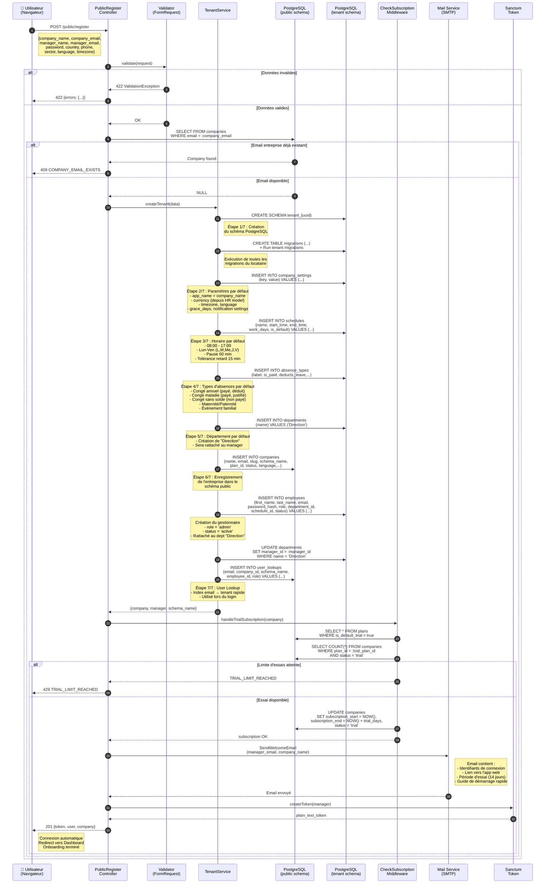

# Diagramme de Séquence — Inscription Publique & Onboarding Auto

> **Projet :** Leopardo RH v3.3.3
> **Date :** 2025
> **Statut :** Dossier de Conception — Diagrammes UML

Ce document présente le diagramme de séquence du flux d'inscription publique `POST /public/register` de la plateforme Leopardo RH. Ce flux permet à un nouveau gestionnaire de créer automatiquement son entreprise et son compte sans intervention du Super Admin, via un onboarding en mode **Trial** (essai). Le processus comprend 7 étapes de provisioning gérées par le `TenantService`, une vérification d'abonnement, la création de l'entreprise, du gestionnaire et la génération du token d'authentification.

---

## Vue d'ensemble — Diagramme de séquence

---

## Explication détaillée des étapes

### Phase 1 — Validation & vérifications préalables

| Étape | Interaction | Détail |
|-------|-------------|--------|
| 1 | **Réception de la requête** | L'utilisateur soumet le formulaire d'inscription publique via `POST /public/register` avec les données de l'entreprise et du gestionnaire (nom, email, mot de passe, pays, secteur, langue, fuseau horaire). |
| 2 | **Validation des données** | Le `FormRequest` vérifie la conformité : nom entreprise requis, email valide et unique, mot de passe minimum 8 caractères avec majuscule + chiffre, pays dans la liste supportée. En cas d'erreur, une réponse 422 est retournée immédiatement. |
| 3 | **Vérification email entreprise** | Le contrôleur interroge le schéma `public` pour vérifier que l'email de l'entreprise n'est pas déjà utilisé. Si c'est le cas, une erreur 409 `COMPANY_EMAIL_EXISTS` est renvoyée pour guider l'utilisateur vers la connexion. |

### Phase 2 — Provisioning du tenant (TenantService)

| Étape | Interaction | Détail |
|-------|-------------|--------|
| 4 | **Création du schéma PostgreSQL** | Le `TenantService` crée un nouveau schéma PostgreSQL nommé `tenant_{uuid}` et exécute l'ensemble des migrations Laravel spécifiques au locataire (tables employees, attendance_logs, absences, payrolls, etc.). |
| 5 | **Insertion des paramètres par défaut** | La table `company_settings` est peuplée avec les valeurs par défaut : nom de l'application, devise (issue du modèle HR du pays), fuseau horaire, langue, jours de grâce, et configuration des notifications. |
| 6 | **Création de l'horaire par défaut** | Un horaire standard 08h00-17h00 (Lun-Ven, pause 60 min, tolérance retard 15 min) est inséré dans la table `schedules` et marqué comme `is_default = true`. |
| 7 | **Insertion des types d'absences** | Cinq types d'absences standards sont créés : congé annuel (payé, déduit du solde), congé maladie (payé avec justification), congé sans solde, maternité/paternité, et événement familial. Ces types sont configurables ultérieurement par le Responsable RH. |
| 8 | **Département par défaut** | Un département « Direction » est créé pour servir de rattachement initial au gestionnaire. Le manager_id de ce département sera mis à jour après la création de l'employé gestionnaire. |
| 9 | **Enregistrement de l'entreprise (public)** | L'entreprise est insérée dans la table `companies` du schéma public avec le slug généré, le nom du schéma locataire, le plan d'essai associé, et le statut initial `trial`. |
| 10 | **Création du gestionnaire + User Lookup** | Le compte du gestionnaire est créé dans le schéma locataire avec le rôle `admin` et le statut `active`. Simultanément, un enregistrement `user_lookups` est inséré dans le schéma public pour permettre la résolution rapide email → schéma lors des connexions ultérieures. |

### Phase 3 — Abonnement & activation

| Étape | Interaction | Détail |
|-------|-------------|--------|
| 11 | **Vérification de la limite d'essais** | Le middleware `CheckSubscription` compte le nombre d'entreprises actuellement en période d'essai pour le plan par défaut. Si la limite configurée est atteinte, l'inscription est refusée (429). |
| 12 | **Activation de l'abonnement d'essai** | L'entreprise est activée en mode `trial` avec une durée configurée dans le plan (par défaut 14 jours). Les dates `subscription_start` et `subscription_end` sont calculées automatiquement. |

### Phase 4 — Finalisation

| Étape | Interaction | Détail |
|-------|-------------|--------|
| 13 | **Email de bienvenue** | Un email transactionnel est envoyé au gestionnaire contenant ses identifiants de connexion, un lien vers l'application web, la durée de la période d'essai et un guide de démarrage rapide pour configurer l'entreprise. |
| 14 | **Génération du token Sanctum** | Un `personal_access_token` Sanctum est généré immédiatement pour le gestionnaire, permettant une connexion automatique sans passer par l'écran de login. |
| 15 | **Réponse de succès** | Le contrôleur retourne un statut 201 avec le token d'authentification, les données du gestionnaire et les informations de l'entreprise. Le client redirige automatiquement vers le tableau de bord. |

---

## Chemins alternatifs (Alt Paths)

| Scénario | Condition | Réponse | Comportement |
|----------|-----------|---------|--------------|
| **Données invalides** | Champs manquants, email invalide, mot de passe faible | `422 ValidationException` | Retour immédiat avec liste des erreurs par champ |
| **Email entreprise existant** | `companies.email` déjà présent en base | `409 COMPANY_EMAIL_EXISTS` | Message invitant à se connecter ou contacter le support |
| **Limite d'essais atteinte** | Nombre d'entreprises `trial` ≥ limite du plan | `429 TRIAL_LIMIT_REACHED` | Message indiquant de contacter le Super Admin pour une activation manuelle |
| **Erreur création schéma** | Erreur PostgreSQL (permissions, disque) | `500 INTERNAL_ERROR` | Nettoyage partiel (rollback) + log d'erreur + notification admin |
| **Échec envoi email** | SMTP indisponible | `201 SUCCESS` (dégradé) | L'inscription réussit mais l'email est mis en file de retry |

---

## Modèle HR & configuration pays

Lors de l'inscription, le système utilise le champ `country` pour charger le modèle RH correspondant depuis `public.hr_model_templates`. Ce modèle fournit les valeurs par défaut pour :

- **Cotisations sociales** (CNAS, CASNOS, mutuelle — pour l'Algérie)
- **Tranches IR** (impôt sur le revenu progressif)
- **Règles de congés** (jours légaux, jours fériés par pays)
- **Devise** (DZD pour l'Algérie, XOF pour l'Afrique de l'Ouest, etc.)

Si aucun modèle n'existe pour le pays spécifié, le système applique un modèle générique avec des valeurs configurables manuellement par le Gestionnaire Principal après l'inscription.
